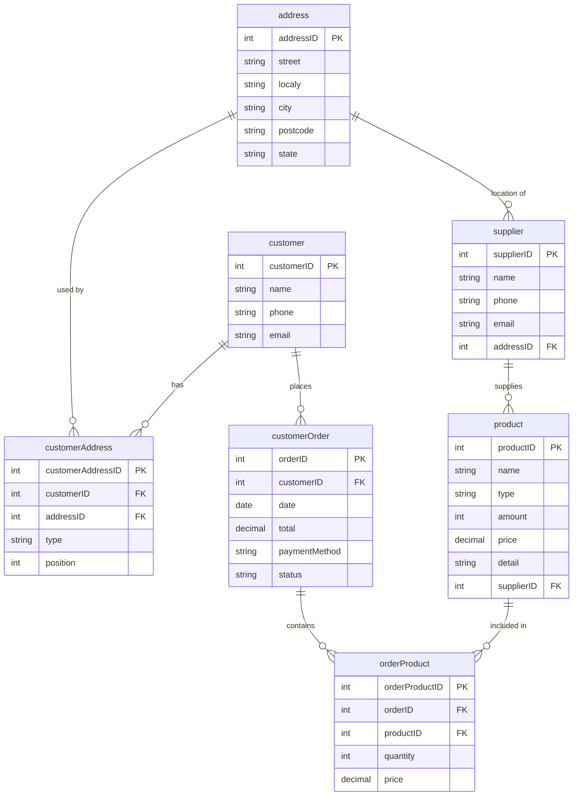
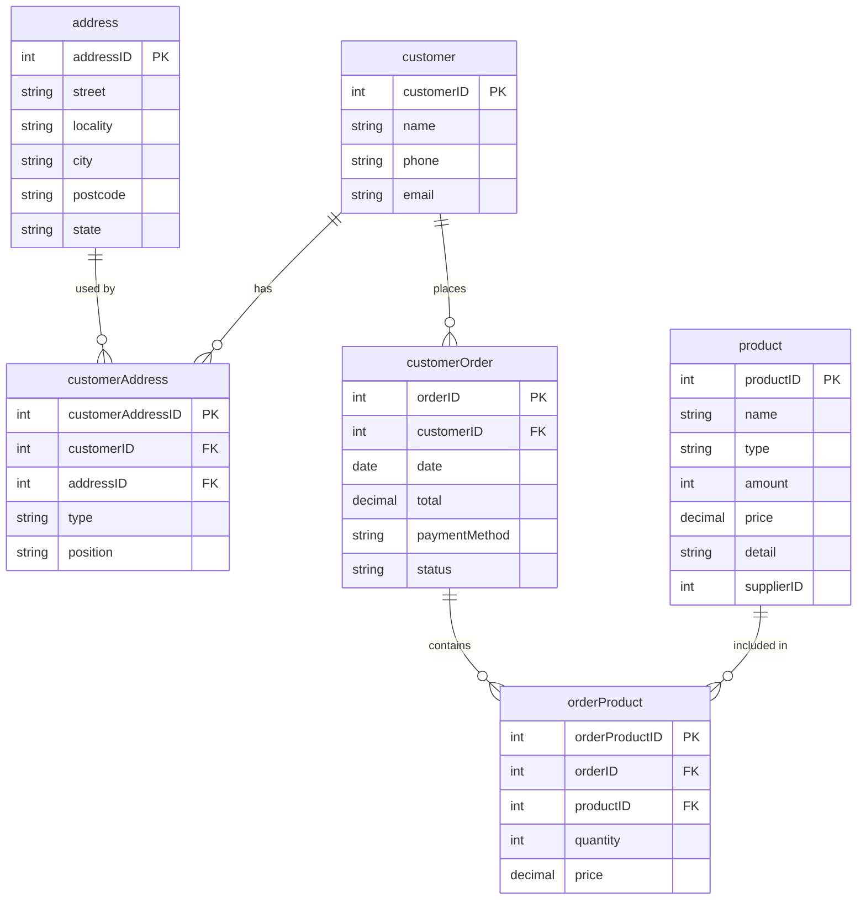
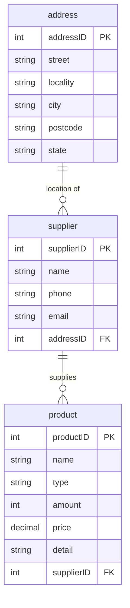

# Distribución de datos
_______________________________

📌 Vertical Fragmentation


**Instructions**. 

For this exercise, the **salesBD** database is used to build the requested fragments.
It uses the [database backup](https://github.com/edcrvl/courses/edit/main/databases/salesBD_bk.sql)  to build the two vertical fragments.

To restore the backup, use the following process.
1. Log in to the MySQL server.
```
   sqlcmd -S localhost\SQLEXPRESS -E
```
2. Create a new database named **salesDB**.
```sql
   CREATE DATABASE salesDB;
   GO
```
3. To restore the salesBD_bk.sql file in the salesDB database, you must exit MySQL and execute the following command:
```
   sqlcmd -S localhost\SQLEXPRESS -E -d salesDB -i C:\Users\royes\Downloads\salesBD_bk.sql
```
4. Verify that the restoration process was complete. Generate the general statistics report with the following script:
```sql
SELECT
    t.name AS Tabla,
    MAX(p.rows) AS Registros,
    CAST((SUM(a.data_pages) * 8.0 * 1024) / MAX(p.rows) AS INT) AS [Tuple size (bytes)],
    CAST(SUM(a.data_pages) * 8.0 / 1024 AS DECIMAL(10,2)) AS [Datos (MB)],
    CAST((SUM(a.used_pages) - SUM(a.data_pages)) * 8.0 / 1024 AS DECIMAL(10,2)) AS [Índices (MB)],
    CAST(SUM(a.used_pages) * 8.0 / 1024 AS DECIMAL(10,2)) AS [Total (MB)]
FROM sys.tables t
JOIN sys.indexes i
     ON t.object_id = i.object_id
JOIN sys.partitions p
     ON i.object_id = p.object_id
    AND i.index_id = p.index_id
JOIN sys.allocation_units a
     ON p.partition_id = a.container_id
WHERE i.index_id <= 1
GROUP BY t.name
ORDER BY Registros DESC;
```
The result should be identical to the following table:

| Tabla           | Registros | Tuple size (bytes) | Datos (MB) | Índices (MB) | Total (MB) |
| --------------- | --------- | ------------------ | ---------- | ------------ | ---------- |
| customeraddress | 110       | 74                 | 0.01       | 0.01         | 0.02       |
| customerorder   | 101       | 81                 | 0.01       | 0.01         | 0.02       |
| orderproduct    | 100       | 81                 | 0.01       | 0.01         | 0.02       |
| product         | 100       | 163                | 0.02       | 0.02         | 0.03       |
| supplier        | 100       | 163                | 0.02       | 0.02         | 0.03       |
| address         | 100       | 163                | 0.02       | 0.02         | 0.03       |
| customer        | 100       | 245                | 0.02       | 0.02         | 0.04       |


The restored backup has a design error in the **customer** table.
Obtain the schema definition of the customer table with the following command:
```sql
    EXEC sp_columns customer;
    GO
```
The result is as follows:

| Field      | Type         | Null | Key | Default | Extra          |
|------------|--------------|------|-----|---------|----------------|
| customerID | int          | NO   | PRI | NULL    | auto_increment |
| name       | varchar(100) | YES  |     | NULL    |                |
| phone      | varchar(20)  | YES  |     | NULL    |                |
| email      | varchar(100) | YES  |     | NULL    |                |
| addressID  | int          | YES  | MUL | NULL    |                |

The _addressID_ attribute must be deleted. 
To do this, execute the following statement to remove the constraint _customer_ibfk_1_ linked to the addressID attribute.
```sql
    ALTER TABLE customer
    DROP CONSTRAINT FK_customer_address;
    GO

    DROP INDEX IX_customer_addressID ON customer;
    GO
```

Now, you can delete the _addressID_ column with the following script:
```sql
ALTER TABLE customer
DROP COLUMN addressID;
```

These lab is based on the following relational model.



# Vertical fragment: _customerDB_

## 1. 🧠 Build a vertical fragment that contains all customer data.

### ✅ Relational model of vertical fragment customerDB.



### ✅ SQL scripts to create a fragment customerDB in MySQL.

To create the database **customerDB** use following command:

```sql
    CREATE DATABASE customerDB;
```
To create the database tables, you must use the following commands:

```sql
USE customerDB;
GO

CREATE TABLE address (
    addressID INT IDENTITY(1,1) NOT NULL,
    street NVARCHAR(100) NOT NULL,
    locality NVARCHAR(100) NOT NULL,
    city NVARCHAR(100) NOT NULL,
    postcode NVARCHAR(10) NOT NULL,
    state NVARCHAR(50) NOT NULL,
    CONSTRAINT pk_address PRIMARY KEY (addressID)
);
GO

CREATE TABLE customer (
    customerID INT IDENTITY(1,1) NOT NULL,
    name NVARCHAR(100) NOT NULL,
    phone NVARCHAR(20),
    email NVARCHAR(100) NOT NULL,
    CONSTRAINT pk_customer PRIMARY KEY (customerID),
);
GO

CREATE TABLE customerAddress (
    customerAddressID INT IDENTITY(1,1) NOT NULL,
    customerID INT NOT NULL,
    addressID INT NOT NULL,
    type NVARCHAR(50) NOT NULL,
    position NVARCHAR(50),
    CONSTRAINT pk_customerAddress PRIMARY KEY (customerAddressID),
    CONSTRAINT fk_ca_customer
        FOREIGN KEY (customerID)
        REFERENCES customer(customerID),
    CONSTRAINT fk_ca_address
        FOREIGN KEY (addressID)
        REFERENCES address(addressID)
);
GO

CREATE TABLE product (
    productID INT IDENTITY(1,1) NOT NULL,
    name NVARCHAR(100) NOT NULL,
    type NVARCHAR(50),
    amount INT NOT NULL DEFAULT 0,
    price DECIMAL(10,2) NOT NULL,
    detail NVARCHAR(255),
    supplierID INT,
    CONSTRAINT pk_product PRIMARY KEY (productID)
);
GO

CREATE TABLE customerOrder (
    orderID INT IDENTITY(1,1) NOT NULL,
    customerID INT NOT NULL,
    date DATE NOT NULL,
    total DECIMAL(10,2) NOT NULL DEFAULT 0.00,
    paymentMethod NVARCHAR(50),
    status NVARCHAR(50) NOT NULL DEFAULT 'pending',
    CONSTRAINT pk_customerOrder PRIMARY KEY (orderID),
    CONSTRAINT fk_co_customer
        FOREIGN KEY (customerID)
        REFERENCES customer(customerID)
);
GO

CREATE TABLE orderProduct (
    orderProductID INT IDENTITY(1,1) NOT NULL,
    orderID INT NOT NULL,
    productID INT NOT NULL,
    quantity INT NOT NULL,
    price DECIMAL(10,2) NOT NULL,
    CONSTRAINT pk_orderProduct PRIMARY KEY (orderProductID),
    CONSTRAINT fk_op_order
        FOREIGN KEY (orderID)
        REFERENCES customerOrder(orderID),
    CONSTRAINT fk_op_product
        FOREIGN KEY (productID)
        REFERENCES product(productID)
);
GO
```

### 📌 Scripts for downloading data from the **salesBD** database in CSV format.

From the command line, we can extract information from a table in a MySQL database and store the content in a plain text file. 
In the following example, data is extracted from the customer table in the salesDB database and saved in the customer.txt file.
``` SQL
bcp "SELECT * FROM salesDB.dbo.address a WHERE exists(SELECT 1 FROM salesDB.dbo.customeraddress ca where a.addressID = ca.addressID)" queryout "C:\Users\royes\Desktop\cust_address.txt" -c -t, -r\n -S localhost -T

bcp "SELECT * FROM salesDB.dbo.customer" queryout "C:\Users\royes\Desktop\fragcustomertrue.txt" -c -t, -r\n -S localhost -T

bcp "SELECT * FROM salesDB.dbo.customerAddress" queryout "C:\Users\royes\Desktop\cust_customerAddress.txt" -c -t, -r\n -S localhost -T

bcp "SELECT * FROM salesDB.dbo.customerOrder" queryout "C:\Users\royes\Desktop\cust_customerOrder.txt" -c -t, -r\n -S localhost -T

bcp "SELECT * FROM salesDB.dbo.product" queryout "C:\Users\royes\Desktop\cust_product.txt" -c -t, -r\n -S localhost -T

bcp "SELECT * FROM salesDB.dbo.orderProduct" queryout "C:\Users\royes\Desktop\cust_orderProduct.txt" -c -t, -r\n -S localhost -T
```

Another option is to download the table content into a file in CSV format 
with the _SELECT INTO OUTFILE_ statement as follows:

```sql
bcp "SELECT * FROM salesDB.dbo.address a WHERE exists(SELECT 1 FROM salesDB.dbo.customeraddress ca where a.addressID = ca.addressID)" queryout "C:\Users\royes\Desktop\cust_address.csv" -c -t, -r\n -S localhost -T

bcp "SELECT * FROM salesDB.dbo.customer" queryout "C:\Users\royes\Desktop\fragcustomertrue.csv" -c -t, -r\n -S localhost -T

bcp "SELECT * FROM salesDB.dbo.customerAddress" queryout "C:\Users\royes\Desktop\cust_customerAddress.csv" -c -t, -r\n -S localhost -T

bcp "SELECT * FROM salesDB.dbo.customerOrder" queryout "C:\Users\royes\Desktop\cust_customerOrder.csv" -c -t, -r\n -S localhost -T

bcp "SELECT * FROM salesDB.dbo.product" queryout "C:\Users\royes\Desktop\cust_product.csv" -c -t, -r\n -S localhost -T

bcp "SELECT * FROM salesDB.dbo.orderProduct" queryout "C:\Users\royes\Desktop\cust_orderProduct.csv" -c -t, -r\n -S localhost -T
```

### 📌 Scripts for loading data from the CSV format files to database customerDB.

```sql
BULK INSERT customerDB.dbo.address
FROM 'C:\Users\royes\Desktop\cust_address.csv'
WITH (FIELDTERMINATOR = ',', ROWTERMINATOR = '\n', CODEPAGE = '65001');

BULK INSERT customerDB.dbo.customer
FROM 'C:\Users\royes\Desktop\cust_customer.csv'
WITH (FIELDTERMINATOR = ',', ROWTERMINATOR = '\n', CODEPAGE = '65001');

BULK INSERT customerDB.dbo.customerAddress
FROM 'C:\Users\royes\Desktop\cust_customerAddress.csv'
WITH (FIELDTERMINATOR = ',', ROWTERMINATOR = '\n', CODEPAGE = '65001');

BULK INSERT customerDB.dbo.customerOrder
FROM 'C:\Users\royes\Desktop\cust_customerOrder.csv'
WITH (FIELDTERMINATOR = ',', ROWTERMINATOR = '\n', CODEPAGE = '65001');

BULK INSERT customerDB.dbo.product
FROM 'C:\Users\royes\Desktop\cust_product.csv'
WITH (FIELDTERMINATOR = ',', ROWTERMINATOR = '\n', CODEPAGE = '65001');

BULK INSERT customerDB.dbo.orderProduct
FROM 'C:\Users\royes\Desktop\cust_orderProduct.csv'
WITH (FIELDTERMINATOR = ',', ROWTERMINATOR = '\n', CODEPAGE = '65001');
```

Another option to extract and load tables form diferent databases (ONLY SQL SERVER)

````SQL
SET IDENTITY_INSERT customerDB.dbo.address ON;

INSERT INTO customerDB.dbo.address (addressID, street, locality, city, postcode, state)
SELECT * FROM salesDB.dbo.address a
WHERE exists(SELECT 1 FROM salesDB.dbo.customeraddress ca where a.addressID = ca.addressID);

SET IDENTITY_INSERT customerDB.dbo.address OFF;


SET IDENTITY_INSERT customerDB.dbo.customer ON;

INSERT INTO customerDB.dbo.customer (customerID, name, phone, email, addressID)
SELECT customerID, name, phone, email, addressID
FROM salesDB.dbo.customer;

SET IDENTITY_INSERT customerDB.dbo.customer OFF;


SET IDENTITY_INSERT customerDB.dbo.customerAddress ON;

INSERT INTO customerDB.dbo.customerAddress (customerAddressID, customerID, addressID, type, position)
SELECT customerAddressID, customerID, addressID, type, position
FROM salesDB.dbo.customerAddress;

SET IDENTITY_INSERT customerDB.dbo.customerAddress OFF;


SET IDENTITY_INSERT customerDB.dbo.customerOrder ON;

INSERT INTO customerDB.dbo.customerOrder (orderID, customerID, date, total, paymentMethod, status)
SELECT orderID, customerID, date, total, paymentMethod, status
FROM salesDB.dbo.customerOrder;

SET IDENTITY_INSERT customerDB.dbo.customerOrder OFF;


SET IDENTITY_INSERT customerDB.dbo.product ON;

INSERT INTO customerDB.dbo.product (productID, name, type, amount, price, detail, supplierID)
SELECT productID, name, type, amount, price, detail, supplierID
FROM salesDB.dbo.product;

SET IDENTITY_INSERT customerDB.dbo.product OFF;


SET IDENTITY_INSERT customerDB.dbo.orderProduct ON;

INSERT INTO customerDB.dbo.orderProduct (orderProductID, orderID, productID, quantity, price)
SELECT orderProductID, orderID, productID, quantity, price
FROM salesDB.dbo.orderProduct;

SET IDENTITY_INSERT customerDB.dbo.orderProduct OFF;
````
# Vertical fragment: _supplierDB_

## 2. 🧠 Build a vertical fragment that contains all supplier data.

### ✅ Relational model of vertical fragment supplierDB.



### ✅ SQL scripts to create a fragment supplierDB in MySQL.

To create the database **supplierDB** use following command:

```sql
CREATE DATABASE supplierDB;
```
To create the database tables, you must use the following commands:

```sql
USE supplierDB;
GO

CREATE TABLE address (
    addressID INT IDENTITY(1,1) NOT NULL,
    street NVARCHAR(100) NOT NULL,
    locality NVARCHAR(100) NOT NULL,
    city NVARCHAR(100) NOT NULL,
    postcode NVARCHAR(10) NOT NULL,
    state NVARCHAR(50) NOT NULL,
    CONSTRAINT pk_address PRIMARY KEY (addressID)
);
GO

CREATE TABLE supplier (
    supplierID INT IDENTITY(1,1) NOT NULL,
    name NVARCHAR(100) NOT NULL,
    phone NVARCHAR(20),
    email NVARCHAR(100) NOT NULL,
    addressID INT NOT NULL,
    CONSTRAINT pk_supplier PRIMARY KEY (supplierID),
    CONSTRAINT fk_supplier_address
        FOREIGN KEY (addressID)
        REFERENCES address(addressID)
);
GO

CREATE TABLE product (
    productID INT IDENTITY(1,1) NOT NULL,
    name NVARCHAR(100) NOT NULL,
    type NVARCHAR(50),
    amount INT NOT NULL DEFAULT 0,
    price DECIMAL(10,2) NOT NULL,
    detail NVARCHAR(255),
    supplierID INT NOT NULL,
    CONSTRAINT pk_product PRIMARY KEY (productID),
    CONSTRAINT fk_product_supplier
        FOREIGN KEY (supplierID)
        REFERENCES supplier(supplierID)
);
GO
```

### 📌 Scripts for downloading data from the **salesBD** database in CSV format.

Another option is to download the table content into a file in CSV format:

```sql
bcp "SELECT * FROM salesDB.dbo.address a WHERE exists(SELECT 1 FROM salesDB.dbo.supplier s where a.addressID = s.addressID)" queryout "C:\Users\royes\Desktop\supplier_address.csv" -c -t, -r\n -S localhost -T

bcp "SELECT * FROM salesDB.dbo.supplier" queryout "C:\Users\royes\Desktop\supplier_supplier.csv" -c -t, -r\n -S localhost -T

bcp "SELECT * FROM salesDB.dbo.product" queryout "C:\Users\royes\Desktop\supplier_product.csv" -c -t, -r\n -S localhost -T
```

### 📌 Scripts for loading data from the CSV format files to database customerDB.

```sql
BULK INSERT supplierDB.dbo.address
FROM 'C:\Users\royes\Desktop\supplier_address.csv'
WITH (FIELDTERMINATOR = ',', ROWTERMINATOR = '\n', CODEPAGE = '65001');

BULK INSERT supplierDB.dbo.supplier
FROM 'C:\Users\royes\Desktop\supplier_supplier.csv'
WITH (FIELDTERMINATOR = ',', ROWTERMINATOR = '\n', CODEPAGE = '65001');

BULK INSERT supplierDB.dbo.product
FROM 'C:\Users\royes\Desktop\supplier_product.csv'
WITH (FIELDTERMINATOR = ',', ROWTERMINATOR = '\n', CODEPAGE = '65001');
```

Another option to extract and load tables form diferent databases (ONLY SQL SERVER)

````SQL
SET IDENTITY_INSERT supplierDB.dbo.address ON;

INSERT INTO supplierDB.dbo.address (addressID, street, locality, city, postcode, state)
SELECT * FROM salesDB.dbo.address a
WHERE exists(SELECT 1 FROM salesDB.dbo.supplier s where a.addressID = s.addressID)

SET IDENTITY_INSERT supplierDB.dbo.address OFF;


SET IDENTITY_INSERT supplierDB.dbo.supplier ON;

INSERT INTO supplierDB.dbo.supplier (supplierID, name, phone, email, addressID)
SELECT supplierID, name, phone, email, addressID
FROM salesDB.dbo.supplier;

SET IDENTITY_INSERT supplierDB.dbo.supplier OFF;


SET IDENTITY_INSERT supplierDB.dbo.product ON;

INSERT INTO supplierDB.dbo.product (productID, name, type, amount, price, detail, supplierID)
SELECT productID, name, type, amount, price, detail, supplierID
FROM salesDB.dbo.product;

SET IDENTITY_INSERT supplierDB.dbo.product OFF;
````

### Script to reconstruct salesDB

````SQL
CREATE DATABASE salesDB2

USE salesDB2

  USE salesDB2;
GO

CREATE TABLE address (
    addressID INT PRIMARY KEY,
    street NVARCHAR(100),
    locality NVARCHAR(100),
    city NVARCHAR(100),
    postcode NVARCHAR(10),
    state NVARCHAR(50)
);

CREATE TABLE customer (
    customerID INT PRIMARY KEY,
    name NVARCHAR(100),
    phone NVARCHAR(20),
    email NVARCHAR(100)
);

CREATE TABLE customerAddress (
    customerAddressID INT PRIMARY KEY,
    customerID INT,
    addressID INT,
    type NVARCHAR(50),
    position NVARCHAR(50)
);

CREATE TABLE supplier (
    supplierID INT PRIMARY KEY,
    name NVARCHAR(100),
    phone NVARCHAR(20),
    email NVARCHAR(100),
    addressID INT
);

CREATE TABLE product (
    productID INT PRIMARY KEY,
    name NVARCHAR(100),
    type NVARCHAR(50),
    amount INT,
    price DECIMAL(10,2),
    detail NVARCHAR(255),
    supplierID INT
);

CREATE TABLE customerOrder (
    orderID INT PRIMARY KEY,
    customerID INT,
    date DATE,
    total DECIMAL(10,2),
    paymentMethod NVARCHAR(50),
    status NVARCHAR(50)
);

CREATE TABLE orderProduct (
    orderProductID INT PRIMARY KEY,
    orderID INT,
    productID INT,
    quantity INT,
    price DECIMAL(10,2)
);

INSERT INTO salesDB2.dbo.address
SELECT *
FROM customerDB.dbo.address;

INSERT INTO salesDB2.dbo.address
SELECT *
FROM supplierDB.dbo.address s
WHERE NOT EXISTS (
    SELECT 1
    FROM supplierDB2.dbo.address a
    WHERE a.addressID = s.addressID
);


INSERT INTO salesDB2.dbo.customer
SELECT * FROM customerDB.dbo.customer;

INSERT INTO salesDB2.dbo.customerAddress
SELECT * FROM customerDB.dbo.customerAddress;

INSERT INTO saleseDB2.dbo.supplier
SELECT * FROM supplierDB.dbo.supplier;

INSERT INTO salesDB2.dbo.product
SELECT * FROM supplierDB.dbo.product

UNION

SELECT * FROM customerDB.dbo.product;

INSERT INTO salesDB2.dbo.customerOrder
SELECT * FROM customerDB.dbo.customerOrder;

INSERT INTO salesDB2.dbo.orderProduct
SELECT * FROM customerDB.dbo.orderProduct;
````
### Check description to the database 

```` SQL
SELECT
    t.name AS Tabla,
    MAX(p.rows) AS Registros,
    CAST((SUM(a.data_pages) * 8.0 * 1024) / MAX(p.rows) AS INT) AS [Tuple size (bytes)],
    CAST(SUM(a.data_pages) * 8.0 / 1024 AS DECIMAL(10,2)) AS [Datos (MB)],
    CAST((SUM(a.used_pages) - SUM(a.data_pages)) * 8.0 / 1024 AS DECIMAL(10,2)) AS [Índices (MB)],
    CAST(SUM(a.used_pages) * 8.0 / 1024 AS DECIMAL(10,2)) AS [Total (MB)]
FROM sys.tables t
JOIN sys.indexes i
     ON t.object_id = i.object_id
JOIN sys.partitions p
     ON i.object_id = p.object_id
    AND i.index_id = p.index_id
JOIN sys.allocation_units a
     ON p.partition_id = a.container_id
WHERE i.index_id <= 1
GROUP BY t.name
ORDER BY Registros DESC;
````

| Tabla           | Registros | Tuple size (bytes) | Datos (MB) | Índices (MB) | Total (MB) |
| --------------- | --------- | ------------------ | ---------- | ------------ | ---------- |
| customerAddress | 110       | 74                 | 0.01       | 0.01         | 0.02       |
| customerOrder   | 101       | 81                 | 0.01       | 0.01         | 0.02       |
| orderProduct    | 100       | 81                 | 0.01       | 0.01         | 0.02       |
| product         | 100       | 163                | 0.02       | 0.02         | 0.03       |
| supplier        | 100       | 163                | 0.02       | 0.02         | 0.03       |
| address         | 100       | 163                | 0.02       | 0.02         | 0.03       |
| customer        | 100       | 163                | 0.02       | 0.02         | 0.03       |

